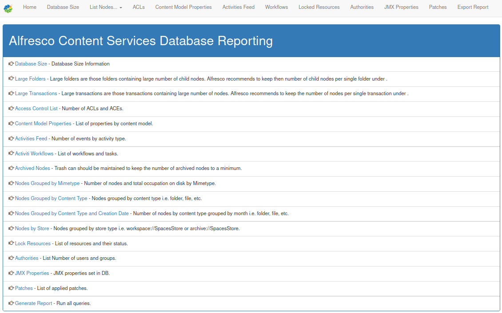
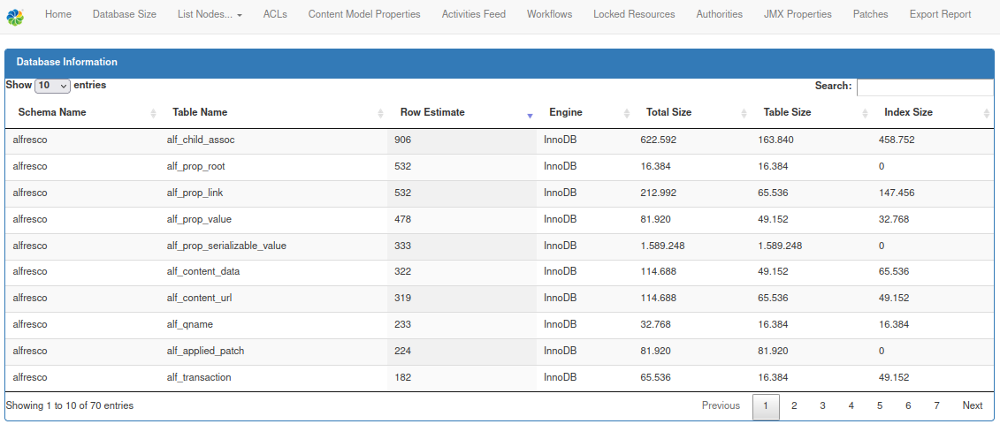

# Alfresco Database Queries Report

Alfresco Database Queries Report is a Spring-Boot application developed to run a set of pre-defined database queries against Alfresco Content Services application. The following reports can be generated:
  - Identify Database Size
  - Identify Large Folders
  - Identify Large Transactions
  - Access Control Lists
  - Content Model Properties
  - List Nodes by MimeType and Disk Space (also by month)
  - List Nodes by Contet Store
  - List Nodes by Content Type
  - List Site Activities
  - List Workflows and Tasks
  - Archived Nodes
  - Authorities count
  - JMX changes
  - Export Report

  Works with Postgres, MySQL databases.
  Future releases will be compatible with Oracle and MS-SQL databases too.

### Installation

Alresco DB Queries project requires Maven and java JDK to build. The build process generates a jar file that can be executed as a stand-alone application.

The steps to build the application are:
 - Download the application - https://git.alfresco.com/premier/alfresco-db-queries/repository/archive.zip?ref=master
 - Unzip it
 - Rename folder to "alfresco-db-queries"
 - Adjust alfresco-db-queries/src/main/resources/application.properties file
    - Set database details
    - Set port for web server
 - Compile and build application

### Compiling and building the executable jar file

The build is based on Maven profiles. The available profiles are:
- postgres
- mysql
- mssql
- oracle

To compile
```sh
cd alfresco-db-queries
mvn compile install -P<profile>
```

If you need to use Oracle Driver, due to Oracle license restriction, there are no public repositories that provide ojdbc jar so you need to install manually (just once) before compiling 
```sh
$ cd alfresco-db-queries
$ mvn install:install-file -Dfile=./lib/ojdbc11.jar -DgroupId=com.oracle -DartifactId=ojdbc11 -Dversion=23.4.0.24.05 -Dpackaging=jar
$ mvn compile install -Poracle
```

The generated jar file should be located in the target folder i.e. target/alfresco-db-0.0.2-SNAPSHOT.jar.

### Running the application

The application specific parameters:
| Parameter | default | Meaning | 
| -| -| -| 
| db.queries.is_enterprise_version | true | Boolean. To specify if you are using ACS Enterprise or Community |
| db.queries.largeFolderSizeThreshold | 1000 | The max number of direct children a folder can have to not be considered "Large" |
| db.queries.largeTransactionSizeThreshold | 10000 | The max amount of nodes that a transaction can modified to not be considered "Large" |
| db.queries.reportExportType | json | Enum. Possible types: json, csv. The export format |
| db.queries.reportExportFolder=./export | ./export | Path. The path where to export the files

**Remember** to set also the spring parameters about DB and server port as well

Copy the application.properties file to the same folder as the jar file and execute the jar file:

```sh
$ cd target
$ java --add-opens=java.base/java.lang=ALL-UNNAMED --add-opens=java.base/java.util=ALL-UNNAMED -jar alfresco-db-0.0.2-SNAPSHOT.jar
```
Finally connect to the running application on [http://localhost:8888](http://localhost:8888) or the port specified by "server.port" parameter in application.properties. 

**Note** : When providing the application to other parties make sure you provide both the jar file and the application.properties file.

### Screenshots

- Home Page



- Database Size Report



### Technologies

This project has been developed with a number of open source projects such as:
  - Built using Maven
  - Developed using Spring-Boot (https://projects.spring.io/spring-boot/)
  - Using mybatis for SQL mapping
  - Using Thymeleaf server-side Java template engine for manipulating object on HTML pages (http://www.thymeleaf.org/)
  - Using Bootstrap for Front-End Web development (http://getbootstrap.com/)
  - Datatables for table formatting (https://datatables.net/)

### Todos

 - Write additional queries
 - Testing, testing and more testing

